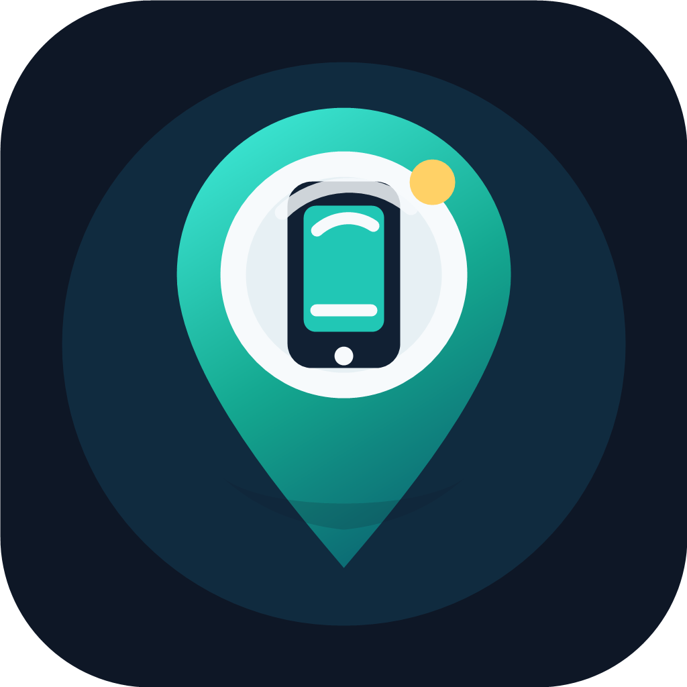

<div align="center">



# 📱 Find My Phone — اعثر على هاتفي

**حماية هاتفك من السرقة، بدون إنترنت وبدون سيرفر وبدون أي اشتراك.**
**Theft protection for your phone — no internet, no server, no subscription. Ever.**

كل الأوامر تعمل عبر رسائل SMS عادية فقط.
Every command runs over plain SMS — nothing else.

[](https://flutter.dev)
[](#)
[](#-الترخيص--license)
[](#)

**🔗 [صفحة التطبيق — App Page](https://abdulquddus-dev.github.io/project/find-my-phone/)** · **📦 [تطبيقاتي الأخرى — More of my apps](https://abdulquddus-dev.github.io/)**

</div>

---

## 🇸🇦 نظرة عامة

**Find My Phone** تطبيق حماية ضد السرقة مبني بالكامل بـ Flutter، مصمم لسدّ فجوة حقيقية: ماذا تفعل إن سُرق هاتفك ولا يوجد إنترنت، أو أُطفئ الجهاز، أو لا تملك اشتراكًا في خدمة تتبع مدفوعة؟

الفكرة بسيطة: **رقم موثوق واحد + رسالة SMS = تحكم كامل بهاتفك المفقود.** لا سيرفر خلفي، لا حساب سحابي، لا مفاتيح API مدفوعة، ولا بيانات تُرسَل لأي جهة خارجية — كل شيء يبقى على جهازك.

## 🇬🇧 Overview

**Find My Phone** is a fully offline, SMS-based anti-theft app for Android, built with Flutter. It solves a real gap: what do you do when your phone is stolen and there's no internet, the thief powers it off, or you simply don't want to pay for a tracking subscription?

The idea is simple: **one trusted phone number + a text message = full control over your lost phone.** No backend server, no cloud account, no paid API keys, and no data ever leaves your device.

---

## ✨ المزايا الرئيسية — Key Features

### 🔐 أوامر SMS ثنائية اللغة — Bilingual SMS Commands

كل أمر يعمل بالإنجليزية أو العربية، من أي رقم **موثوق** مسبقًا فقط:

| الأمر EN | الأمر AR | الوظيفة |
|---|---|---|
| `LOCATE code` | `موقع code` | إرسال آخر موقع معروف على الخريطة |
| `SILENTLOCATE code` | `موقع_صامت code` | تحديد الموقع بصمت دون تنبيه مرئي |
| `ALARM code` | `انذار code` | تشغيل إنذار صوتي واهتزاز بأقصى صوت |
| `INFO code` | `معلومات code` | إرسال حالة البطارية، الشبكة، ومعلومات SIM |
| `LOCK code` | `قفل code` | قفل شاشة الجهاز فورًا عن بُعد |
| `RESET newcode` | `استرجاع newcode` | تعيين رمز طوارئ جديد بدون معرفة القديم (لأرقام موثوقة فقط) |

### 🗺️ خرائط مجانية بالكامل — Fully Free Maps
يعتمد على **OpenStreetMap** عبر `flutter_map` — بدون أي مفتاح API، وبدون الحاجة لبطاقة ائتمان أو حساب فوترة على Google Cloud.

### 🛡️ حماية من إلغاء التثبيت — Anti-Uninstall Protection
عبر Device Admin API: يمنع إلغاء تثبيت التطبيق مباشرة، ويُرسل تنبيهًا فوريًا لكل جهات الاتصال الموثوقة إن حاول أحدهم تعطيل الحماية.

### 🔒 قفل التطبيق نفسه — App Tamper Protection
رمز دخول منفصل (أو رمز الطوارئ نفسه) قبل فتح التطبيق، مع إعادة القفل التلقائي بعد ترك التطبيق في الخلفية.

### 📶 كشف تغيير الشريحة — SIM Change Detection
تنبيه فوري لجهات الاتصال الموثوقة عند تركيب شريحة SIM مختلفة عن التي أُعدّ التطبيق عليها.

### 🚫 حماية من التخمين المتكرر — Brute-Force Lockout
بعد عدة محاولات رمز فاشلة، تُقفل الأوامر مؤقتًا وتُنبَّه جهات الاتصال الموثوقة تلقائيًا.

### 🌐 عربي/إنجليزي بالكامل — Fully Bilingual
واجهة كاملة RTL/LTR، بدون أي نص إنجليزي متبقٍ في تجربة المستخدم العربية.

### 🔐 تشفير محلي كامل — Fully Encrypted Local Storage
كل البيانات (جهات الاتصال، رمز الطوارئ، السجل) مخزّنة محليًا فقط عبر SQLCipher و EncryptedSharedPreferences — لا شيء يُرفع لأي سيرفر.

### 🔋 استهلاك طاقة منخفض — Battery Efficient
لا توجد أي مؤقتات أو استعلامات دورية في الخلفية — التطبيق يعمل بالكامل بنمط رد الفعل (event-driven): يستيقظ فقط عند وصول رسالة SMS، تغيير SIM، أو إعادة تشغيل الجهاز. تحديد الموقع يستخدم FusedLocationProvider بدلًا من GPS الخام لتوفير أقصى قدر من الطاقة.

---

## 🖼️ لقطات الشاشة — Screenshots

<div align="center">
<!-- ضع لقطات الشاشة هنا — Add your screenshots here -->
<!-- 

 -->
</div>

---

## 🔑 الأذونات المطلوبة — Required Permissions

| الإذن | لماذا هو ضروري |
|---|---|
| `RECEIVE_SMS` / `SEND_SMS` | استقبال أوامر SMS والرد عليها |
| `ACCESS_FINE_LOCATION` | تحديد الموقع الجغرافي عند طلب `LOCATE` |
| `RECEIVE_BOOT_COMPLETED` | استمرار الحماية بعد إعادة تشغيل الجهاز |
| `BIND_DEVICE_ADMIN` | تفعيل الحماية من إلغاء التثبيت وقفل الشاشة عن بُعد |
| `FOREGROUND_SERVICE_MEDIA_PLAYBACK` | تشغيل الإنذار الصوتي بشكل موثوق (مطلوب في أندرويد 14+) |
| `REQUEST_IGNORE_BATTERY_OPTIMIZATIONS` | ضمان استمرار عمل التطبيق في الخلفية دون تأخير |

---

## 🚀 التشغيل محليًا — Getting Started

### المتطلبات — Prerequisites
- Flutter SDK (القناة المستقرة — stable channel)
- Android Studio / أي محرر يدعم Flutter
- جهاز أندرويد فعلي يدعم SMS (المحاكيات لا تدعم استقبال/إرسال SMS حقيقي)

---

## 🧭 كيف يعمل — How It Works

```
┌─────────────┐     SMS      ┌──────────────────────┐    WorkManager    ┌───────────────────┐
│ رقم موثوق    │ ───────────▶ │  SmsCommandReceiver  │ ─────────────────▶│ SmsProcessorWorker │
│ Trusted #   │              │  (BroadcastReceiver)  │                    │ • تحقق الثقة        │
└─────────────┘              └──────────────────────┘                    │ • تحقق الرمز        │
                                                                          │ • تنفيذ الأمر       │
                                                                          │ • رد + تسجيل        │
                                                                          └───────────────────┘
```

1. يرسل رقم **موثوق** (مُسجَّل مسبقًا في التطبيق) رسالة أمر + رمز الطوارئ.
2. يتحقق التطبيق من هوية المرسل ثم من صحة الرمز (مُشفّر محليًا، لا يُخزَّن كنص صريح أبدًا).
3. يُنفَّذ الأمر (تحديد موقع، إنذار، قفل...) ويصل رد فوري لنفس الرقم.
4. يُسجَّل كل حدث في سجل التدقيق داخل التطبيق للمراجعة لاحقًا.

---

## 🔗 روابط — Links

- **صفحة التطبيق — App page:** https://abdulquddus-dev.github.io/project/find-my-phone/
- **تطبيقاتي الأخرى — More apps by the developer:** https://abdulquddus-dev.github.io/

---

## 📄 الترخيص — License

هذا المشروع مرخّص بموجب [MIT License](LICENSE).

This project is licensed under the [MIT License](LICENSE).

---

<div align="center">

صُنع بـ ❤️ لحماية ما يهمك، دون أن يكلّفك ذلك خصوصيتك أو أموالك.

Made with ❤️ to protect what matters — without costing you your privacy or your money.

</div>
